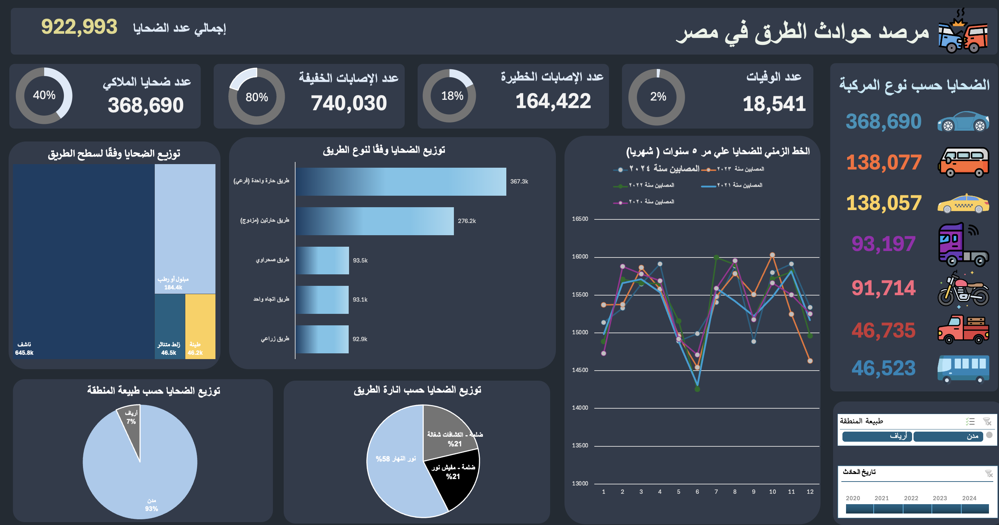

# 🚦 Egypt Road Accidents Data Analysis (Fictional Data)

This project is a **strategic data analysis** of road accidents in Egypt using a **fictional dataset** of over **310,000 records**.

## 📊 Features
- Data cleaning & preprocessing (duplicates, missing values, unified categories).
- Full Excel Dashboard with KPIs:
  - Total victims, fatalities, serious & slight injuries.
  - Road type risk analysis.
  - Urban vs Rural impact.
  - Seasonal/monthly accident trends.
- Localization (all columns & values in Arabic – Egyptian context).
- Insights into urban concentration of accidents, dangerous road types, and vehicle categories.

## 🛠 Tools Used
- Microsoft Excel (Power Query, Pivot Tables, Charts).
- Data Cleaning & Transformation.
- Visualization & Dashboard Design.

## 📎 Notes
- The dataset is **synthetic** (not real).
- Designed to simulate realistic accident data in Egypt while maintaining a global schema structure.
- 
## 🖥️ Dashboard Preview

---
## 📂 Dataset
Due to GitHub's file size limitations,  all files are hosted on Google Drive.
You can access and download all the project files from the link below:[Download Dataset from Google Drive](https://drive.google.com/drive/folders/1lqbMIOKOjxmN-2nIVaykNCVmPv3KUish?usp=drive_link)
---
## 🚀 How to Use
1. Clone or download this repository.
2. Download the dataset from the Google Drive link above.
3. Open the Excel file and enable macros/pivot functionality if needed.
4. Navigate to the Dashboard sheet to explore the analysis.

## 🔮 Future Work
- Automate data pipeline using Python/Pandas.
- Build interactive Power BI dashboard.
- Add predictive analysis (accident forecasting).

## 👤 Author
Developed by [Ahmed Mustafa Alazab]  
- LinkedIn:  https://www.linkedin.com/in/ahmedmalazab

### 📌 Tags
`Excel` `Data Analysis` `Big Data` `Visualization` `Dashboard` `Traffic Accidents`
